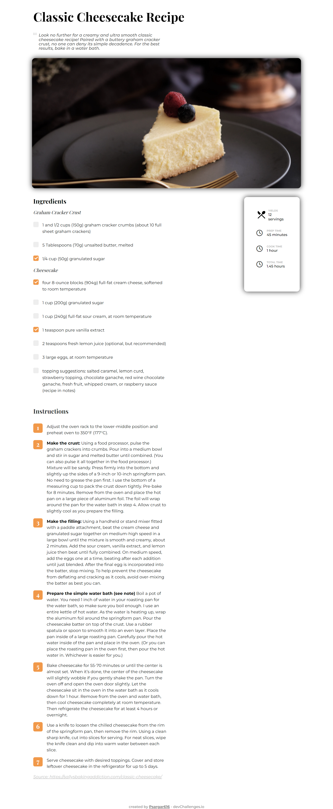

<!-- Please update value in the {}  -->

<h1 align="center">{Recipe Page - Devchallenges.io}</h1>

   Solution for a challenge from  <a href="http://devchallenges.io" target="_blank">Devchallenges.io</a>.

  <h3>
    <a href="https://psargar616.github.io/recipe-page-master/">
      Demo
    </a>
     | 
    <a href="https://github.com/Psargar616/recipe-page-master">
      Solution
    </a>
     | 
    <a href="https://devchallenges.io/challenges/OEKdUZ6xs0h99C38XVht">
      Challenge
    </a>
  </h3>

<!-- TABLE OF CONTENTS -->

## Table of Contents

- [Overview](#overview)
  - [Built With](#built-with)
- [Features](#features)
- [Contact](#contact)
- [Acknowledgements](#acknowledgements)

<!-- OVERVIEW -->

## Overview

Created a beautiful and responsive 'Recipe Page' using HTML and CSS.
Also learned how to add custum checkboxes to webpage.

### Built With

- HTML
- CSS

## Features

This application/site was created as a submission to a [DevChallenges](https://devchallenges.io/challenges) challenge. The [challenge](https://devchallenges.io/challenges/TtUjDt19eIHxNQ4n5jps) was to build an application to complete the following user stories:

Challenge: Create a recipe page following the given design. You can use your own recipe and remember to put the source. The page should be responsive. Don’t look at the existing solutions. Fulfill user stories below:

- User story: I can see a recipe with ingredients and instructions
- User story: I can select a checkbox if I have the ingredients
- User story: I can see the number of servings, baking times

## Acknowledgements

<!-- This section should list any articles or add-ons/plugins that helps you to complete the project. This is optional but it will help you in the future. For exmpale -->

- [Steps to replicate a design with only HTML and CSS](https://devchallenges-blogs.web.app/how-to-replicate-design/)
- [Custom checkboxes](https://www.w3schools.com/howto/howto_css_custom_checkbox.asp)

## Contact

- GitHub [@Psargar616](https://github.com/Psargar616)

